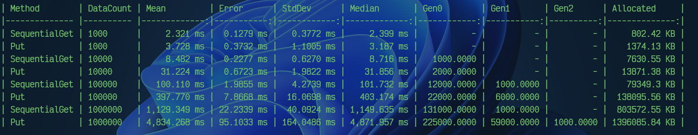

# Aligo
Aligo 是一个用 C# 开发的高性能键值（Key-Value）数据库，专注于提供低延迟、高吞吐量的数据存储解决方案。支持多种数据操作模式，适用于缓存、配置管理、会话存储等场景。

## 核心特性

- 采用 Key/Value 的数据模型，实现数据存储和检索的快速、稳定、高效
- 存储模型：采用 Bitcask 存储模型，具备高吞吐量和低读写放大的特征
- 持久化：实现了数据的持久化，确保数据的可靠性和可恢复性
- 索引：多种内存索引结构，高效、快速数据访问
- 并发控制：使用锁机制，确保数据的一致性和并发访问的正确性


## ⚙️ 安装与使用

### 1. 环境要求

- .NET SDK 6.0 或更高版本
- 推荐操作系统：Windows/macOS/Linux

### 2. 快速启动

```csharp


// 创建数据库实例（默认内存模式）
var engineOps = new EngineOptions("your dir path");
var engine = new Engine(engineOps);

// 写入数据
byte[] key = Encoding.UTF8.GetBytes("your key");
byte[] value = Encoding.UTF8.GetBytes("your value");
var putRes = engine.Put(key,value);

// 读取数据 value
byte[] getRes=engine.Get(key);

// 删除数据,返回被删除的value
var deleteRes = engine.Delete(key);

// 批量操作示例
var option = new WriteBatchOptions()
{
    MaxBatchSize = 1_000,
    SyncWhenCommited = true,
};
var batch = engine.CreateWriteBatch(option);
for (int i = 0; i < 1_000; i++)
	{      
    	var k =  Encoding.UTF8.GetBytes($"key {i}");
    	var v =  Encoding.UTF8.GetBytes($"value {i}");
  		batch.Put(k,v);
   }
batch.Commit();
```


## Benchmark


**Dictionary Indexer** Simple Test



## 贡献指南

1. Fork 本仓库
2. 创建特性分支：`git checkout -b feature/new-feature`
3. 提交代码：`git commit -am 'Add some feature'`
4. 推送分支：`git push origin feature/new-feature`
5. 提交 Pull Request


##  支持

- 报告问题：[GitHub Issues](https://github.com/chuanchuanYY/Aligo/issues)
- 联系作者：[chuanchuanYY](https://github.com/chuanchuanYY)

